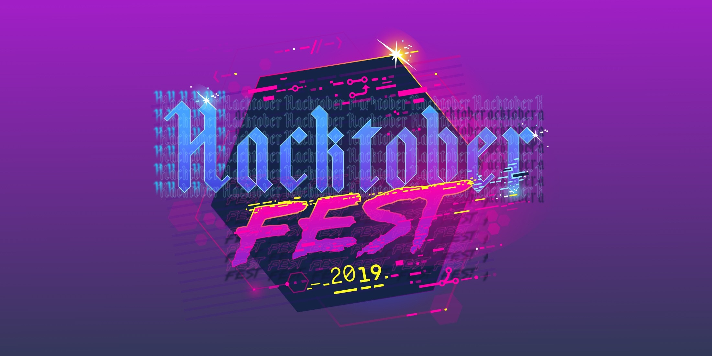

# Hacktoberfest

## What is this all about?

The intent of Hacktoberfest is to help support and grow the open source community. All backgrounds, regardless of skillsets and expertise are welcome. There is something for everyone!

By the end, you should be the proud owner of a GitHub account, and enough know-how to engage with the community and contribute back.

## Why bother?

### Build relationships with passionate individuals
The majority of open source projects are built and maintained by individuals who do it because they're passionate about it. More often than not they are estatic to have help, and will welcome any efforts you put towards their project.

### Exposure to a wide variety of problems
Open source is a lot like the wild west. Projects are written in different languages, require

### Drive change in a way that makes sense for you.

- Solve problems faster

## The wordy stuff

### It's just Git

...

### Forks

...

### Code in the wild

... https://github.com/microsoft/vscode

## The techy stuff

### Prerequisites

1. Create an account on GitHub. A link to their signup page can be found [here](https://github.com/join?source=header-home).

1. Sign up for [Hacktoberfest](https://hacktoberfest.digitalocean.com/). You'll need to associate your GitHub account from the step above.

## Looking for more?

During Hacktoberfest, most GitHub repositories will label issues that they feel are a good fit with `Hacktoberfest`.

If you're interested in contributing even more, you can find all of the issues with the `Hacktoberfest` label [here](htps://github.com/search?q=label%3Ahacktoberfest+state%3Aopen+is%3Aissue&type=Issues).
